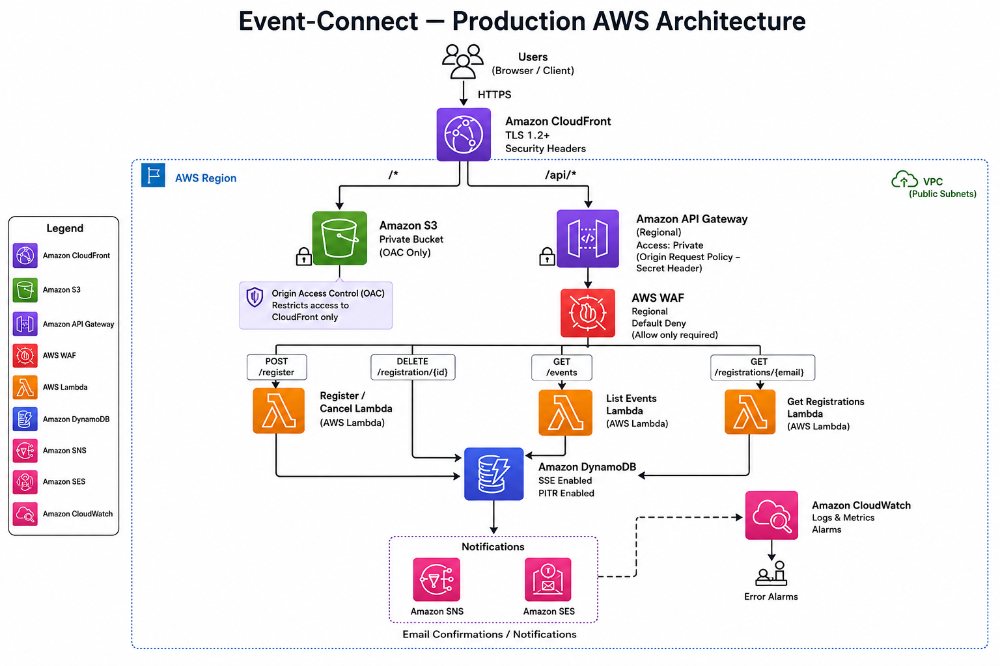

# Event-Connect — Serverless Event Registration

Production AWS stack: **CloudFront** is the only public HTTPS endpoint. API Gateway stays a private origin (WAF + origin secret). Existing DynamoDB tables (`events-prod`, `registrations-prod`) are retained.

---

## Live site

After deploy, the public site is:

**https://d3mbqhiwlx08nz.cloudfront.net**

Do not publish or paste API Gateway `execute-api` URLs into the frontend, README, or GitHub Pages. Direct calls to API Gateway are blocked.

---

## Architecture



```
Browser
  └── CloudFront  (public HTTPS, security headers)
        ├── /*        → private S3 bucket (OAC)
        └── /api/*    → API Gateway origin + X-Origin-Verify
                          └── Regional WAF (default deny)
                                └── Lambda + DynamoDB + SNS/SES
```

- Frontend calls same-origin paths only: `/api/events`, `/api/register`, `/api/registrations/{email}`, `/api/registration/{id}`
- CloudFront strips `/api`, injects the origin secret, and forwards to API Gateway
- WAF and Lambda reject any request missing that secret
- `GET /api/registrations` lists attendees for the dashboard; `GET /api/registrations/{email}` filters by attendee

See [docs/ARCHITECTURE.md](docs/ARCHITECTURE.md).

---

## Repository layout

```text
event-registration-system/
├── template.yaml              # Full AWS stack (CloudFront, S3, WAF, API, Lambda, DynamoDB)
├── samconfig.toml             # Local deploy settings (gitignored; no secrets)
├── frontend/                  # Static UI published to S3 + CloudFront
├── src/handlers/              # Lambda code
├── scripts/sync-frontend.ps1  # Upload UI and invalidate CloudFront
└── .github/workflows/deploy.yml
```

---

## Deploy

### Prerequisites
- AWS CLI and SAM CLI
- Python 3.12

### 1. Backend (keeps existing prod tables)

```bash
sam build
sam deploy --no-confirm-changeset --parameter-overrides Stage=prod
```

`Stage=prod` is required so CloudFormation continues to use `events-prod` and `registrations-prod`.

### 2. Frontend

```powershell
.\scripts\sync-frontend.ps1
```

```bash
bash scripts/sync-frontend.sh
```

### 3. Tests

```bash
pip install -r tests/requirements-test.txt
python -m pytest tests/ -v
```

---

## API (via CloudFront only)

| Method | Path | Notes |
|---|---|---|
| GET | `/api/events` | Catalog with live seat counts |
| POST | `/api/register` | Rejects duplicates and full events |
| GET | `/api/registrations` | All confirmed attendees |
| GET | `/api/registrations/{email}` | Filter by attendee email |
| DELETE | `/api/registration/{id}` | Cancel a ticket |

---

## Secrets

The Resend API key lives in Secrets Manager, not in the template, stack parameters, or Lambda environment variables. CloudFormation creates an unusable placeholder; you write the real value once:

```bash
aws secretsmanager put-secret-value \
  --secret-id event-registration-system/resend-api-key \
  --region us-west-1 \
  --secret-string '{"apiKey":"re_YOUR_NEW_KEY"}'
```

To rotate: create a new key in Resend, delete the old one there, then run the command above with the new value. No redeploy is needed — the function reads it on the next invocation.

## Email delivery

SES is the primary sender, with Resend as the fallback. **SES is still in sandbox mode**, so it can only deliver to identities verified in `us-west-1`. Every other recipient is served by Resend, which is why the fallback must stay working.

Resend sends from `ResendFromEmail` (default `onboarding@resend.dev`). To send from your own domain, verify it in Resend first, then deploy with `ResendFromEmail=noreply@yourdomain`.

To lift the SES restriction, request production access for SES in `us-west-1`.

## Other notes

- The committed Resend key is in git history. It is still in use by choice; revoke it in Resend if that changes.
- GitHub Pages hosting is removed so the UI cannot leak API Gateway URLs.

---

## Cleanup

DynamoDB tables use `DeletionPolicy: Retain`. `sam delete` removes compute and CDN resources but keeps event and registration data.
